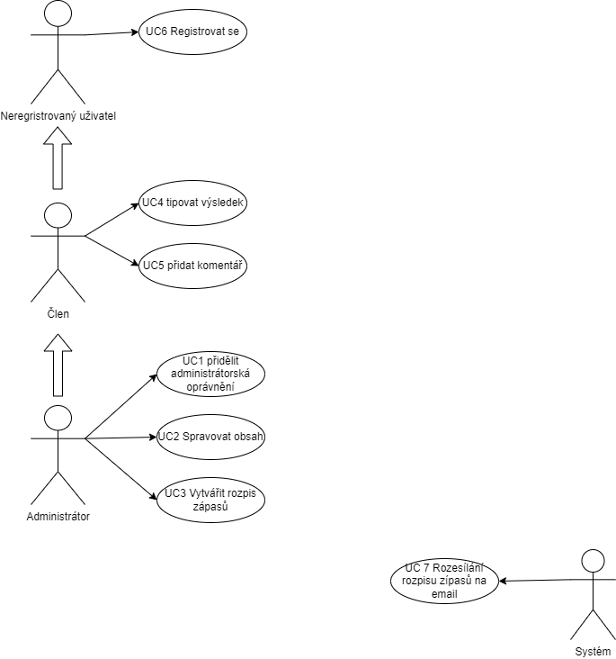

# Webová aplikace pro sázení na zápasy

Tato aplikace lsouží k tomu že uživatel může sázet na jednotlivé zápasy a psát k nim komentáře. Neregristrovaný uživatel se může stát uživatelem pomocí toho že se registruje. Zprávu aplikace provádí administrátor který je schopen přidělit administrátorská oprávnění, upravovat obsah a vytvářet zápasy n které se pak dá sázet. V aplikaci je automatizovaný bot který rozesílá upozornění na zápasy emailem.

## UC1 - Přidělení administrátorských oprávnění

Tento UC slouží aby mohl admistrátor přidávat další administátorská oprávnění.

**Aktéři**

- Administrátor

**Podmínky**

1. Uživatel kterého chce administrátor povýšit na admina tak musí být registrovaný

**Základní tok**

1. Administrátor vybere uživatele kterému chce přidělit administrátorská oprávnění
2. Aministrátor povýší uživatele na administrátora

**Alternativní tok**  
1.1 Admin vybere uživatele který neexistuje a bude mu navrženo bud at konkrétního uživatele zaregistruje nebo vybere již existujícího uživatele

## UC2 - Spravovat obsah

Tato funkce slouží k tomu aby administrátor mohl upravovat a mazat nehodné komentáře.

**Aktéři**

- Administrátor

**Podmínky**

1. Komentář který chce administrátor upravit musí existovat

**Základní tok**

1. Administrátor vybere komentář který chce upravit nebo smazat
2. Aministrátor upraví nebo smaže daný komentář

**Alternativní tok**  
1.1 Admin vybere komentář který neexistuje a je upozorněn že tento komentář neexistuje (Například jiný administrátor ho už změnil a on si pouze neaktilizoval stránku)

## UC3 - Vytváření rozpisu zápasů

Tato funkce slouží k tomu aby administrátor mohl vytváře zápasy na které pak uživatelé mohou sázet.

**Aktéři**

- Administrátor

**Podmínky**

1. Daný zápas nesmí existovat

**Základní tok**

1. Administrátor vybere vybere aktéry zápasu přidá čas zápasu a tentozápas uloží

**Alternativní tok**  
1.1 Admin se pokusí vytvořit zápas který už existoju systém ho upozorní že tento zápas již existuje

## UC4 - Tipovat výsledek

Tato funkce slouží k tomu abymohl uživatel sázet na jednotlivé zápasy.

**Aktéři**

- Administrátor
- Uživatel

**Podmínky**

1. Zápas na který chce uživatel sázet musí existovat

**Základní tok**

1. Uživatel si vybere zápas na který chce sázet
2. Uživatel vsadí na zápas požadovanou sumu

**Alternativní tok**  
1.1 Uživatel se pokusí vsadit na zápas který neexistuje a bude systémem upozorněn že daný zápas neexistuje
2.1 Uživatel se bude snažit vsadit více než má svůj bilanc nebo je maximální možná sázka na zápas. V tomto případ ho systém upozorní na tento problém a požádá ho aby svou sázku změnil

## UC5 - Napsat komentář

Tato funkce slouží k tomu abymohl uživatel mohl napsat komentář k jednolivým zápasům.

**Aktéři**

- Administrátor
- Uživatel

**Podmínky**

1. Zápas nke kterému chce uživatel napsat komentář musí existovat musí existovat
2. Komentář musí mít pouze maximální délku

**Základní tok**

1. Uživatel si vybere zápas ke kterému chce napsat komentář
2. Uživatel Uživatel napíše komentář a potvrzením ho dá zapat do databáze.

**Alternativní tok**  
1.1 Uživatel se pokusí napsat komentář k zápasu který neexistuje. Uživatele systém s touto skutčností obeznámí a řeknemu ať si vybere jiný zápas na který vsadit
2.1 Uživatel napíše příliš dlouhý komentář systém mu vrátí o kolik znaků přetáhl

## UC6 - Zaregistrovat se

Tato funkce slouží k tomu abymohl se mohl neregistrovaný uživatel registrovat.

**Aktéři**

- Administrátor
- Uživatel
- Neregistrovaný uživatel

**Podmínky**

1. Vybrané uživatelské jméno nesmí existovat

**Základní tok**

1. Neregistrovaný uživatel si vybere své uživatelské jméno a potvrdí ho

**Alternativní tok**  
1.1 Uživatelské jméno již bylo registrováno. Neregistrovaný uživatel bude požádán aby si vybral jiné uživateslké jméno

## UC5 - Rozesílání rozpisů zápasů emailem

Tato funkce slouží k tomu abymohl systém rozesílat všem uživatelům informace o zápasech.

**Aktéři**

- Systém

**Podmínky**

1. Systém může rozesílat pouze zápasy které existují a uživatelům ktřeří existují

**Základní tok**

1. Systém si z databáze načte všechny uživatele a všechny zápasy
2. Systém všem na jejich emailové adresy zašle všechny zápasy

## Use case diagram

