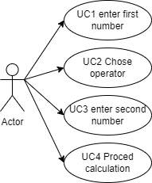

# Jednoduchá kalkulačka

V této aplikaci je nutné aby aktér nejdříve zadal obě čísla a vybral operátor a teprve kliknutím na tlačítko `vypočítej` se zadané vstupy zvalidují a provede se samotný výpočet

**UC1, UC2 a UC3** mají pouze jednoho aktéra a to uživatele, zároveň nemají žádnou vstupní podmínku

## UC3 výpočet

Tento UC zvaliduje vstupy od uživatele a vykoná výpočet

**Aktéři**

- uživatel
- systém

**Podmínky**

1. Obě zadané hodnoty musí být ve tvaru čísla
2. Druhé číslo při dělení nesmí být nula

**Základní tok**

1. Uživatel klikne na `vypočítej`
2. Systém vstup naparsuje na číslo
3. Systém vykoná výopčet
4. Systém zobrazí výsledek

**Alternativní tok 1**

    2.1 pokud uživatel zadal neplatné číslo, systém jej na to upozorní a vytve uživatele, aby číslo zadal znova.

**Alternativní tok 2**

    3.1 pokud dělitel bude 0, systém uživatel upozortní že dělit nulou leze a vytve jej, aby zadal jiné číslo

## Use case diagram:

