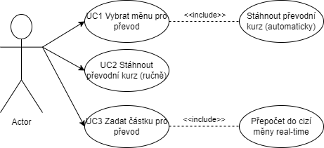

# Měnová kalkulačka

Tato aplikace složí k převodu jedné jměny do jiné pomocí online převodních kurzů

## UC1 - Výběr požadované měny

Tento UC slouží k tomu že si uživatel vybere měnu ze která chce převádě na měnu na kterou chce sumu převést. Poté co si uživatel vybere své měny systém automaticky stáhně převodní kurz mezi těmito měnami.

**Aktéři**

- Uživatel
- Systém

**Pomínky**

1. Obě měny musí existovat

**Záskladní tok**

1. Uživatel si vybere svou měnu
2. Uživatel si vybere měnu na kterou chce převádět
3. Systém stáhne požadovaný převodní kurz

**Alternativní tok**

1.1 a 2.1 Pokud uživatel napíše měnu která neexistuje systém ho na to upozorní a poprosí ho o nové zadíní jeho měny

## UC2 - Stáhnutí převodního kurzu ručně

Tento UC slouží k tomu že pokud se měna z nějakého důvod například chyby připojení k internetu měna nestáhne automaticky uživatel jí může ručně doinstalovat.

**Aktéři**

- Uživatel

**Pomínky**

1. Převodní kurz není k dispozici

**Záskladní tok**

1. Uživatel klikne na tlačítko stáhnout převodní kurz

**Alternativní tok**

1.1 pokud se akce nezdaří například z důvodu stáleho problému s připojením k internetu bude uživatel na tuto skutečnost upozorněn a následně bude vyzván k opakování akce

## UC3 - Zadání částky pro převod

Tento UC slouží k tomu že uživatel zadá částku kterou chce převést a systém mu to real-time konvertuje do požadované měny

**Aktéři**

- Uživatel
- Systém

**Pomínky**

1. Částka kterou uživatel zadává musí obsahovat poute čísla
2. Systém musí dysponovat převodním kurzem

**Záskladní tok**

1. Uživatel zadá částku kterou chce převést
2. Systém zkontroluje validytu dat a dostupnost převodního kurzu
3. Systém převede částku do nové měny

**Alternativní tok**

2.1 Pokud hodnota kterou uživatel zadá nebude číselná bude upozorněn že se nejdní o číslo a bude vyzván k zadíní nového čísla  
2.2 Pokud není stažen převodní kurz bude uživatel upozorněn na tuto skutečnost a bude vyzván ke stáhnutí tohoto kurzu

## Use case diagram:

